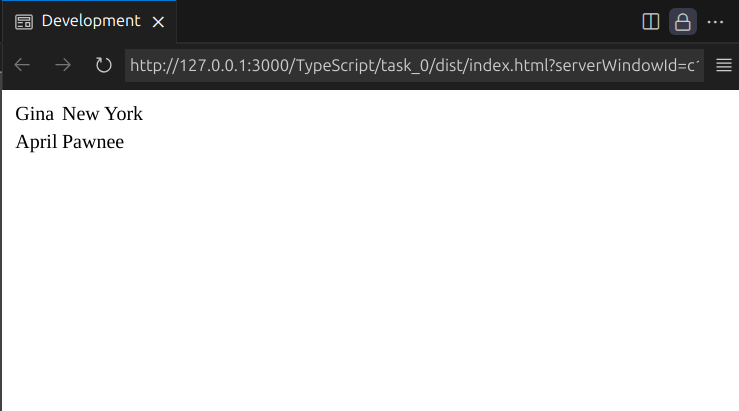
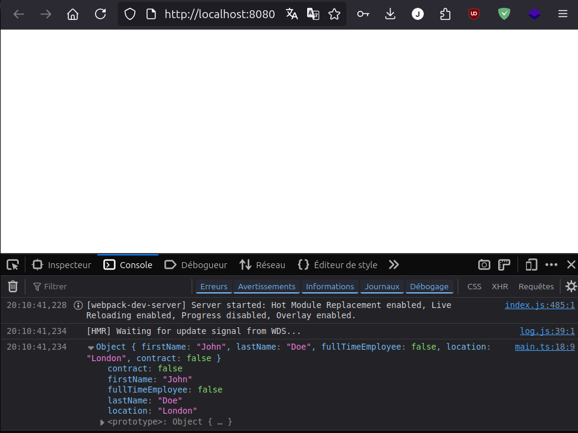

# 
Typescript

- [Learning Objectives](#Learning_Objectives)
- [Requirements](#requirements)
- [Mandatory Tasks](#Mandatory_Tasks)

## Learning Objectives

At the end of this project, you are expected to be able to explain to anyone, without the help of Google:

- Basic types in Typescript
- Interfaces, Classes, and functions
- How to work with the DOM and Typescript
- Generic types
- How to use namespaces
- How to merge declarations
- How to use an ambient Namespace to import an external library
- Basic nominal typing with Typescript

## Requirements

- Allowed editors: `vi`, `vim`, `emacs`, `Visual Studio Code`
- All your files should end with a new line
- All your files will be interpreted/compiled on Ubuntu 18.04
- Your TS scripts will be checked with jest (version 24.9.* )
- A `README.md` file, at the root of the folder of the project, is mandatory
- Your code should use the `ts` extension
- The Typescript compiler should not show any warning or error when compiling your code

## Mandatory tasks

### Task 0. Creating an interface for a student

### Task 1. Let's build a Teacher interface

### Task 2. Extending the Teacher class
### Task 3. Printing teachers
### Task 4. Writing a class
### Task 5. Advanced types Part 1
### Task 6. Creating functions specific to employees
### Task 7. String literal types
### Task 8. Ambient Namespaces
### Task 9. Namespace & Declaration merging
### Task 10. Brand convention & Nominal typing

# Author

Julie Dedieu: [Julieed-971](https://github.com/Julieed-971/)