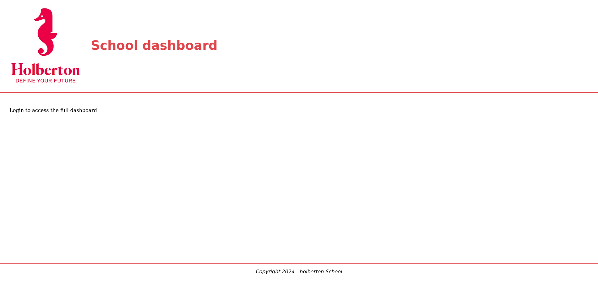
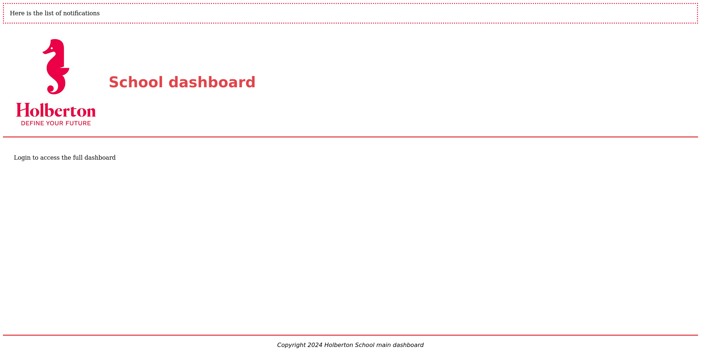
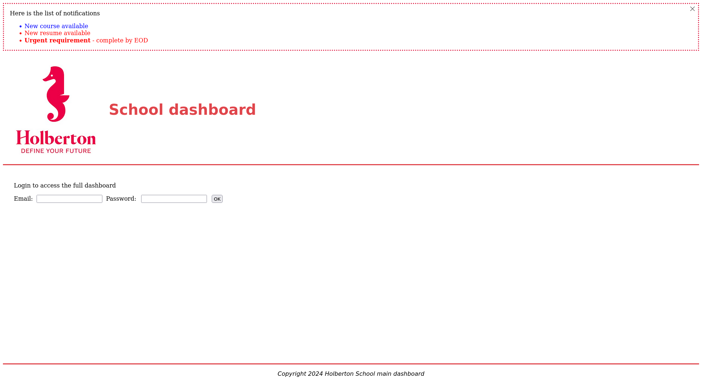
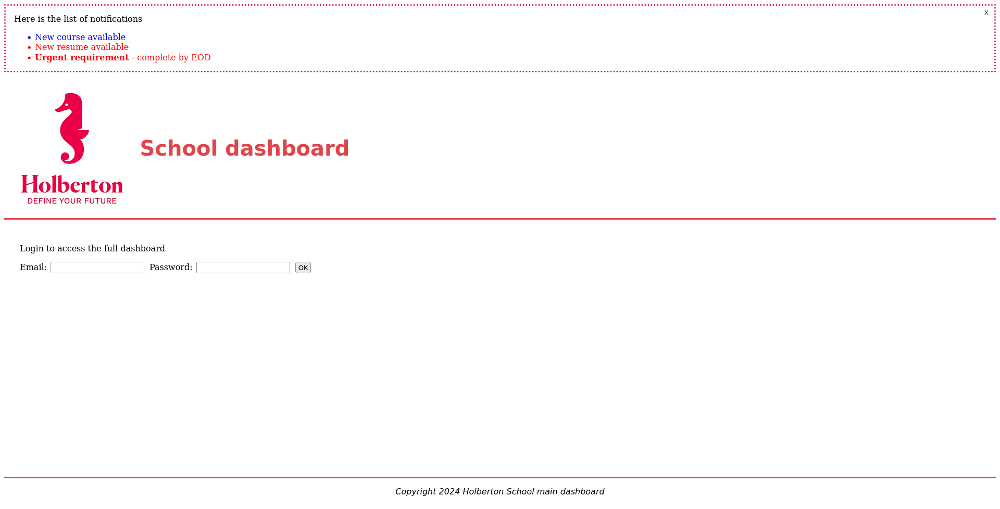
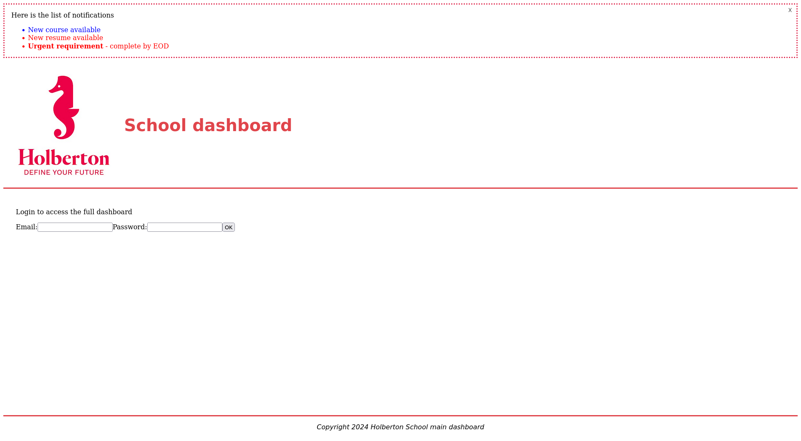

# <p align="center">React Intro</p>

# Description

This project introduces the fundamentals of React development, covering basic application setup, JSX, component creation, testing, and deployment. You'll learn to build a simple dashboard application using Vite as the build tool and implement unit tests using React Testing Library.

## Learning Objectives

At the end of this project, you are expected to be able to explain to anyone, without the help of Google:

- How to create a basic Javascript application with React
- How to use the build tool vite to start developing quickly with React
- What JSX is and how it works
- How to add inline styles in React
- How to implement simple forms in React
- How to implement unit tests using React Testing Library
- How to use the React Developer Tools to debug your code
- How to deploy a react application to GitHub pages

## Requirements

- All your files will be interpreted/compiled on Ubuntu 20.04 LTS using node 20.x.x or greater and npm 10.x.x
- Allowed editors: vi, vim, emacs, Visual Studio Code
- All your files should end with a new line
- A README.md file, at the root of the project's folder and each task's folder, is mandatory
- Install Jest globally: `npm install -g jest`

## Mandatory Tasks

<details close><summary>
  
### Task 0. Basic application

</summary>

**Create a basic app named dashboard using the build tool vite in your `task_0` directory.**

You will need a favicon, the Holberton logo, and a close button image. Download these files and place the logo and button images in the src/assets folder, and put the favicon in the public folder.

**holberton-logo.jpg**  


**favicon.ico**  


**close-button.png**  


**Remove unused files:**
- `index.css` 
- `public/vite.svg` and `src/assets/react.svg`

**Update `index.html`:**
  - Change title to "Holberton - School dashboard"
  - Change icon to Holberton's logo

Set up the following files in the project root folder:

- `setupTests.js`:
```
import '@testing-library/jest-dom';
```
- `.babelrc`:
``` 
{
    "presets": [
        "@babel/preset-env",
        ["@babel/preset-react", { "runtime": "automatic" }]
    ]
}
```

- `fileTransformer.js`:

```
import path from 'path';

export default {
    process(sourceText, sourcePath, options) {
        return {
            code: `module.exports = ${JSON.stringify(path.basename(sourcePath))};`,
        };
    },
};

```

- Configure Jest in `package.json`:

```

"jest": {
    "testEnvironment": "jsdom",
    "moduleNameMapper": {
  "\\.(jpg|jpeg|png|gif|eot|otf|webp|svg|ttf|woff|woff2|mp4|webm|wav|mp3|m4a|aac|oga)$": "<rootDir>/fileTransformer.js",
  "^.+\\.(css|less|scss)$": "identity-obj-proxy"
},
"setupFilesAfterEnv": [
  "./setupTests.js"
]
}
```

- Make sure to install the following packages:
  - `@babel/preset-env`
  - `@babel/preset-react`
  - `identity-obj-proxy`
  - `@testing-library/jest-dom`
  - `@testing-library/react`
  - `jest-environment-jsdom`
  - `@testing-library/user-event`

**In `task_0/dashboard/src/App.jsx`, create a function `App` that returns:**
- A `div` with a class `App-header` containing the Holberton logo with `alt` text: `holberton logo`, and a `h1` with the text `School dashboard` (color: #e1003c)
- A div with a class `App-body` containing a paragraph with the text `Login to access the full dashboard`
- A div with a class `App-footer` containing a paragraph with the text `Copyright {the current year e.g: 2025} - holberton School`

**Add the CSS styles to the `App.css` to match the design in the screenshot below:**



**Requirements:**

- Push your `package.json` and Make sure the jest package is included.
- Use the same names for the downloadable images (`holberton-logo.jpg`, `close-button.png`, `favicon.ico`).
- Ensure the lint check passes without errors (hint: add `Jest` as the test runner in the ESLint configuration file).
- Make sure the app's style matches the screenshot.
- No lint errors

</details>

<details close><summary>

### Task 1. Basic Tests

</summary>

Testing is a crucial part in the web development. in React projects, you’ll use the `React Testing Library` and `Jest` as a test runner.

Create a new file named `App.spec.js` inside the src folder, and add the following imports:

- `render` and `screen` from `@testing-library/react`
- The `App` component

Now that all dependencies are imported, let's write the first tests:

- Write a test to check if the `h1` element with the text `School Dashboard` is rendered.
- Write a test to check that the text content within the 2 `p` elements in the app-body and app-footer divs matches the text shown in the previous task screenshot.
- Write a test to check if an `img` element is rendered.

**Tips:**
- Use a single query to check for the `<h1>` element and its text content
- Match the `` element using its alt attribute's text content
- Ignore case sensitivity in your assertions

**File:** `task_0/dashboard/src/App.spec.js`

</details>

<details close><summary>

### Task 2. Embedding expressions, functions

</summary>

**Using your code from the previous task, create a new file `task_1/dashboard/src/utils.js`:**

- Create a function `getCurrentYear` that will return the current year.
- Create a function `getFooterCopy`:
  - It accepts one argument `isIndex`(boolean).
  - When true, the function should return `Holberton School`, otherwise it'll return `Holberton School main dashboard`
- Update the `<div>` App-footer in `App.jsx` to use these two functions.

**Add a new file `task_1/dashboard/src/Notifications.jsx`, and create a Notifications function:**

- The function should return a `<div>` with the class `notification-items`
- The div should contain a paragraph with the text `Here is the list of notifications`

**Create a new file `task_1/dashboard/src/Notifications.css` where you add the necessary styles to match the design shown in the provided screenshot.**

**Render the Notifications component:**

- Update `App.jsx`:
  - Render the new `Notifications` component and wrap it inside a `div` with class `root-notifications`

Use the React browser extension to check if the `Notifications` component is nested correctly as a child of the `App` component.

**Requirements:**

- The new `Notifications` component should be implemented as a child within `App` in `App.jsx`.
- Ensure the lint check passes with no errors.




</details>

<details close><summary>

### Task 3. Modify the App

</summary>

Using your code from the previous task, in `task_2/dashboard/src/App.jsx` under the paragraph with text Login to access the full dashboard:

- Add a `label` and an `input` element for email.
- Add a `label` and an `input` element for password.
- Add a `button` element with the text "OK"

**Requirements:**

- When the user clicks on a label element, the corresponding input field should be focused
- No lint errors should appear

**File:** `task_2/dashboard/src/App.jsx`

</details>

<details close><summary>

### Task 4. Test the sign in form

</summary>

Let's test the new form.

Update the `App.spec.js` file to add the following tests:

- Check whether the `App` component renders 2 input elements (one for email and the other for password)
- Check whether the `App` component renders 2 label elements with the text `Email` and `Password`.
- Check whether the `App` component renders a button with the text 'OK'

**Tips:**

- Use `regex` to ensure case-insensitive matching.

</details>

<details close><summary>

### Task 5. Update the Notifications

</summary>

**Update `task_2/dashboard/src/utils.js`:**

- Create a function `getLatestNotification`:
  - This function should return the following string: `<strong>Urgent requirement</strong> - complete by EOD`

**Update `task_2/dashboard/src/Notifications.jsx` in the Notifications div:**

- Add a button element:
  - Style the button inline so it appears on the right side of the notifications box. (without using the CSS file):
  - Add the attribute `aria-label` with the value `Close`.
  - When the user clicks the button, it should log `Close button has been clicked` to the console.
- Add an `` tag inside the button:
  - The `` should import the close-icon.png image.
- Add an unordered list `<ul>` after the paragraph:
  - The list should contain the following items:
    - First item: Default priority with the text `New course available`
    - Second item: Urgent priority with the text `New resume available`
    - Last item: Display the text returned by `getLatestNotification` using `dangerouslySetInnerHTML`.
- Add a data attribute for priority:
  - Assign a priority level to the first and second list items using a `data-priority` attribute.

In `task_2/dashboard/src/Notifications.css`:

- Add CSS styles to match the screenshot below.

**Requirements:**

- No lint errors should show up
- Your app should look like the following screenshot:




</details>

<details close><summary>

### Task 6. Utils tests

</summary>

**Update `task_3/dashboard/src/utils.spec.js`:**

Use Jest to test the following functions to ensure they return the desired outputs:

- Write a test to check that the function `getCurrentYear` returns the correct year (be careful to not create a time bomb).
- Write a test to check that `getFooterCopy` returns the correct string when the argument is true or false.
- Write a test to check the returned string form `getLatestNotification`


</details>

<details close><summary>

### Task 7. Test the notifications list

</summary>

**In `task_3/dashboard/src/Notifications.spec.js` create the following tests:**

- Add a test to check the existence of the notifications title `Here is the list of notifications`.
- Add a test to check the existence of the `button` element in the notifications.
- Verify that there are 3 `li` elements as notifications rendered, as shown in the shared screenshot.
- Check whether clicking the close button logs `Close button has been clicked` to the console.

**Tips:**

- Take a look at how RTL (React Testing Library) handles user events.
- Use the `fireEvent` API to simulate a click event for the button.

**Requirements:**

- Make sure your tests ignore case to ensure better test coverage.


</details>

<details close><summary>

### Task 8. Deploy to a GitHub page

</summary>

Deploy your application to GitHub Pages using the `gh-pages` branch.

Add the link to your deployed web page within a new file in the `task_4/dashboard` folder and name it `holberton-dashboard.txt`

**Requirement:**

- Your web page Holberton dashboard must match the design shown in the provided screenshot.




</details>

<details close><summary>

### Task 9. Reorganize the files

</summary>

Let's restructure the project:

- Create folder structure:
  - Move every file related to the `App` into an `App` folder.
  - Move every file related to the `Notifications` into a `Notifications` folder.
  - Move every file related to the utility functions into a `utils` folder.
  - Move every asset file (like images, logos) into an `assets` folder.
- Set up the favicon.ico:
  - Place the favicon.ico in the `public` folder.

**Requirements:**

- Make sure to fix the import statements in your files, so all tests run successfully.
- The `favicon.ico` should be displayed on the React application browser tab.
- Your React application should look similar to the one shown in the screenshot below.
- No lint errors.

**Screenshot at this level:**



</details>

# Author

Julie Dedieu: [Julieed-971](https://github.com/Julieed-971/)
