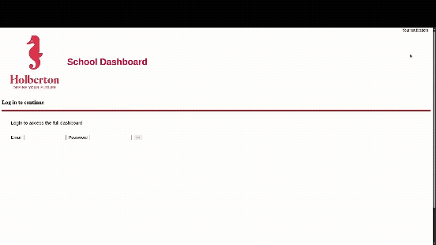

### Task 0. Now You See ME (The easy way)

In this task you'll manage to fix an issue that affects your React Application performance.

This issue is unnecessary re renders in the Notifications component

**To visualize this performance issue:**

Go to the Notifications component and place a console log with any text of your choice and try to toggle the notifications items on our browser and you'll see the number of logs increases with the number of clicks

The issue is that `displayDrawer` state in Redux triggers re-renders of the Notifications component even when the underlying notifications data hasn't changed. This happens because (the short story): 
- UI visibility toggles (show/hide) are mixed with API data in the same state slice which forcing a full re-render with every drawer toggle action dispatched

**To address the issue** (there are plenty ways to achieve that but we'll stick to the following):

**In the `notificationsSlice`:**

- Starting by removing the `displayDrawer` from the initial state
- Remove the `showDrawer` & `hideDrawer` reducers
- Update exports to exclude visibility-related actions

**In the Notifications component:**

- Remove any logic related to the `displayDrawer` state (state access, handlers, etc)
- Create a reference to the notification items' container using `useRef` hook and store it in a new variable `DrawerRef`
- Implement `handleToggleDrawer` handler that adds/removes the `visible` Aphrodite style object on the DOM element to control display/hide
- Make sure to attach ref to drawer element
- Wire up the new handler that was handled previously with `handleHideDrawer` and `handleDisplayDrawer`

**For styles:**

Find the style object for the notification drawer container and add these properties:

- `opacity: 0`
- `visibility: "hidden"`

Add a new style object with the exact name `visible`:

- `opacity: 1`
- `visibility: "visible"`

**Tests:**

Clean up your unit tests relies on the actions `hideDrawer` & `showDrawer` Update your unit tests to rely on Aphrodite `visible` object to toggle the notification items

**Requirements:**

The Notifications component should not be rendered when the show/hide events are triggered

ALL your new unit tests PASS

No console warns or errors

No lint errors

