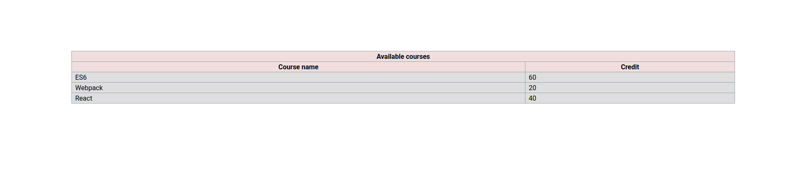
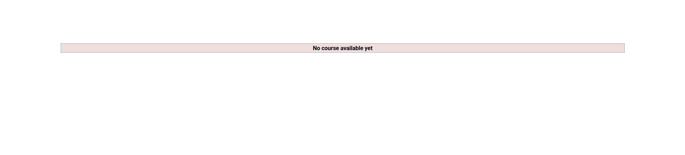
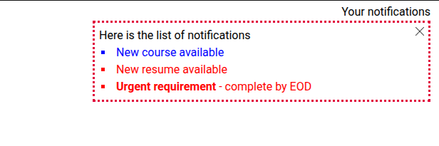
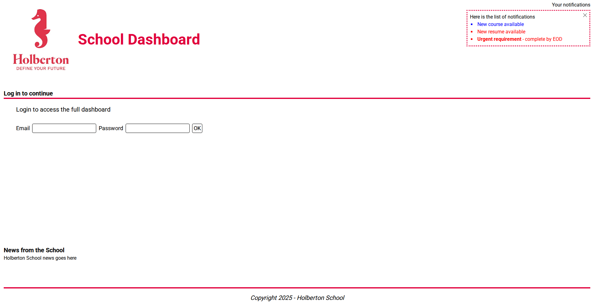
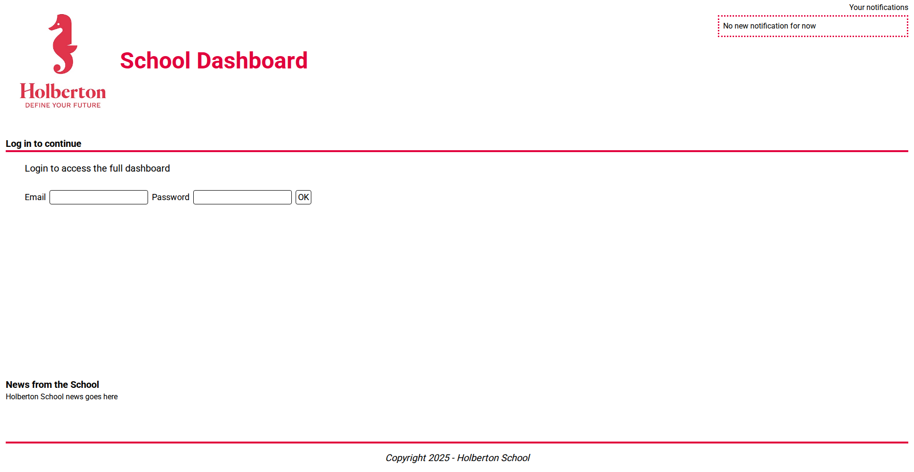
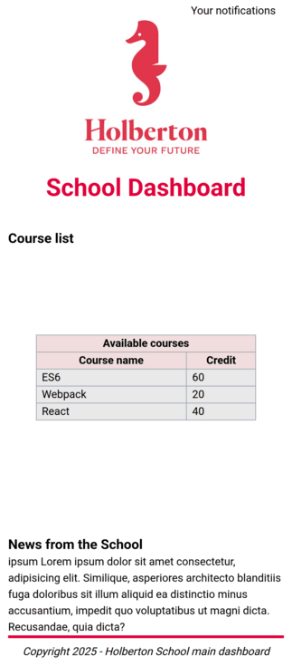
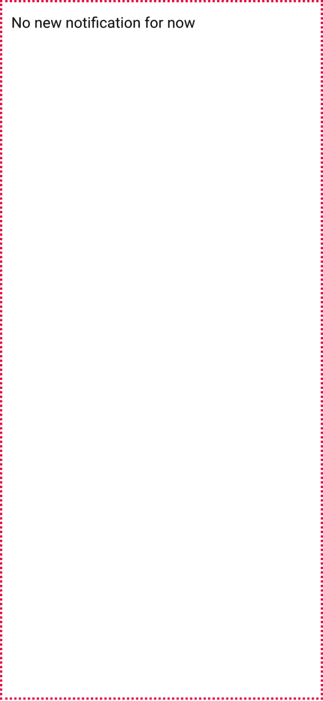

# 
React Styling

# Description

This project focuses on integrating and utilizing TailwindCSS v4 in a React application. You'll learn to convert traditional CSS to Tailwind utility classes, implement responsive design, manage custom color themes, and create animations while maintaining component functionality and test coverage.

## Learning Objectives

At the end of this project, you are expected to be able to `explain to anyone`, **without the help of Google**:

- How to integrate and utilize TailwindCSS v4 within an existing React application without configuration files
- How to declare and use CSS custom properties for consistent theming and color management
- How to apply conditional styling based on component props
- How to implement responsive design using Tailwind's breakpoint syntax for adapting UI across different screen sizes
- How to create and apply animations using Tailwind's utility classes

## Requirements

- All your files will be interpreted/compiled on Ubuntu 20.04 LTS using `node 20.x.x` and `npm 10.x.x`
- Allowed editors: `vi`, `vim`, `emacs`, `Visual Studio Code`
- A `README.md` file, at the root of the project's folder and each task's folder, is mandatory
- Install Jest globally: `npm install -g jest`
- Install TailwindCSS version 4
- All your tasks will be tested on a headless chrome browser

## Mandatory Tasks

### Task 0. Set TailwindCSS

Copy over the `task_5` directory from the React components project and rename it `task_0`

In order to add TailwindCSS to the project, you have to install the following npm package:

- `@tailwindcss/vite` and follow the docs to integrate successfully TailwindCSS v4

**In the `src/main.css` file:**

- Add a theme configuration that defines the Roboto font family
- Use Tailwind's layer system to set Roboto as the default font for the entire application
- You'll need to install this package `@fontsource/roboto`

**In the `src/main.jsx` file:**

Add appropriate import statements to include three different weights of the Roboto font:
- Regular weight (`400`) for normal body text
- Medium weight (`500`) for semi-emphasized text
- Bold weight (`700`) for headings and strong emphasis

**Requirement:**

- You're not allowed to create any TailwindCSS configuration file
- As the tailwind integration won't affects the app logic all your existing RTL unit tests should PASS

### Task 1. Update CourseList and CourseListRow styles

Create a new folder `task_1` and paste the `task_0/dashboard` folder into it

**Create a new file `main.css` and make sure:**

Add 2 background color variables:
- `--color-table-header: #deb5b5`
- `--color-table-rows: #CDCDCD`

**In the `CourseListRow.jsx`:**

- Add the bg colors declared above conditionally whenever the table row is a header or a simple one
- Add the opacity of `66%` for the header rows and `45%` otherwise
- Add a border around the table's cells with the `gray` color and shade of `400`
- Add a padding left of `8px` for the td elements (you should use the appropriate tailwindcss class)

**In the `CourseList.jsx`:**

- The responsive container that wrapped your table should occupies `80%` of the page width
- The table should expand to fill its container completely
- Center the container on the page with appropriate spacing

The courses table should look consistent whether it contains data or is empty

**Requirement:**

- Your final UI must match provided screenshots
- Don't remove any existing classes or ids
- You're not allowed to create any TailwindCSS configuration file
- As the tailwind integration won't affects the app logic all your existing RTL unit tests should PASS
- No CSS file import statement in both components
- No `src/CourseList/*.css` files allowed

### Task 2. Update the Notifications Panel

In this task_2 you'll continue converting the CSS rules into Tailwind classes:

**In the `main.css`:**

Add 3 color variables:
- `--main-color: #e1003c`
- `--default-notification-item: blue`
- `--urgent-notification-item: red`

**In the `NotificationItem.jsx`:**

Use the notification colors defined above where you:
- Apply notification colors based on the item type e.g: default = blue or urgent = red
- Consider how to reference the new color variables within Tailwind class names for text colors

**In the `Notifications.jsx`:**

- Make sure to set the title `Your Notifications` at right and on top of the notification panel
- Ensure that surround the notification panel with a `dashed` border with the color variable `--main-color`
- The notification panel should occupy approximately `25%` of the page width on desktop screens
- Adding a padding from all sides around the notification items of `6px` using the appropriate tailwindcss class

**Requirements:**

- Remove the styles tests from the `NotificationItem.spec.js` file
- Your final UI should be the same as shown in the screenshots below
- Don't remove any existing classes or ids
- You're not allowed to create any TailwindCSS configuration file
- As the tailwind integration won't affects the app logic all your existing RTL unit tests should PASS
- No CSS file import statement in both components
- No `src/Notifications/*.css` files allowed

### Task 3. Update the remained styles

In this task you will convert the rest of the components styles to use Tailwind instead

**In the `Header.jsx`:**

- Convert existing CSS rules to Tailwind classes
- Use the `--main-color` for the heading text color
- Consider the layout structure and alignment of logo and title (think about using flexbox)

**In the `Login.jsx`:**

- Ensure the top border uses the `--main-color` variable
- Convert the form layout to use Tailwind classes (think about using flexbox)
- The Login UI should match the provided screenshot

**In the `BodySectionWithMarginBottom.jsx` & `BodySection.jsx`:**

- Convert existing CSS rules to Tailwind classes
- Adjust spacing and typography using Tailwind's design system, e.g: margins, padding, and text styling

**In the `Footer.jsx`:**

- Ensure the top border color uses the `--main-color` variable
- Convert existing styling to Tailwind classes
- Consider text styling and layout alignment
- Position the Footer at the bottom of the layout container, ensuring it stays fixed to the bottom edge across all viewport sizes and content lengths

**Requirements:**

- Your final UI should be the same as shown in the screenshots below
- Don't remove any existing classes or ids
- You're not allowed to create any TailwindCSS configuration file
- As the tailwind integration won't affects the app logic all your existing RTL unit tests should PASS
- No CSS file import statement in all components
- No `*.css` files allowed (except for the `main.css` that's already provided)

layout_1:

layout_2:

layout_3:

### Task 4. Go Responsive

In this task you'll be asked to work on the responsiveness of your Holberton Dashboard application

**In the `Notifications.jsx`:**

- Make the notifications panel responsive, particularly for screen sizes below `912px`
- Consider how notification items should occupy the viewport on smaller screens e.g: full width/height of the screen
- Adjust list styling of the notification items for mobile devices (think about bullet points and spacing)
- Add appropriate padding and border styling for notification items
- Consider positioning and layering when notification items are full-screen
- Adding a padding from all sides around the notification items of `12px` on mobile/tablet screens using the appropriate tailwindcss class

**In the `NotificationItem.jsx`:**

- Implement responsive text sizing for different screen widths
- Add proper border and padding for list items on smaller screens

**In the `App.jsx`:**

- Create a responsive container structure for the entire application
- Adjust padding for different screen sizes
- Use flexbox layout to ensure proper content distribution across viewport heights

**In the `Header.jsx`:**

- Implement responsive layout that adapts to smaller screens (consider stacking vs horizontal layout)
- Adjust text sizes for breakpoints below `520px`
- Maintain proper alignment and spacing across all device sizes

**In the `Login.jsx`:**

- Make form inputs appropriately sized on mobile screens
- Consider vertical vs horizontal layout for form elements on different screen sizes

**In the `CourseList.jsx`:**

- Ensure the course table remains responsive and properly sized

**In the `Footer.jsx`:**

- Implement responsive text sizing for various screen widths
- Consider footer positioning in the overall layout e.g: stick to the bottom

**Note:**

The long text used under the `News from the school` is intentionally to test responsive behavior in this section, and you'll use it only for this task:

_text: ipsum Lorem ipsum dolor sit amet consectetur, adipisicing elit. Similique, asperiores architecto blanditiis fuga doloribus sit illum aliquid ea distinctio minus accusantium, impedit quo voluptatibus ut magni dicta. Recusandae, quia dicta?_

**Requirements:**

- Your final UI should be the same as shown in the screenshots
- Don't remove any existing classes or ids
- You're not allowed to create any TailwindCSS configuration file
- No CSS file import statement in all components
- No `*.css` files allowed (except for the `main.css` that's already provided)

layout_1:

layout_2:

layout_3:

layout_4:

### Task 5. Animation

In this task you'll apply a `tailwind bounce animation` to the notifications title `Your notifications`

The condition is simple, in the `Notifications.jsx`:

- Whenever the `notifications` prop array length is > 0 AND the `displayDrawer` prop is set to `false` then add the bounce animation
- Otherwise no bounce animation applied
- Consider how to conditionally apply CSS classes in React based on prop values

**Requirements:**

- Your final UI should be the same as shown in the screenshots
- Don't remove any existing classes or ids
- You're not allowed to create any TailwindCSS configuration file
- No CSS file import statement in all components
- No `*.css` files allowed (except for the `main.css` that's already provided)

# Author

Julie Dedieu: [Julieed-971](https://github.com/Julieed-971/)
